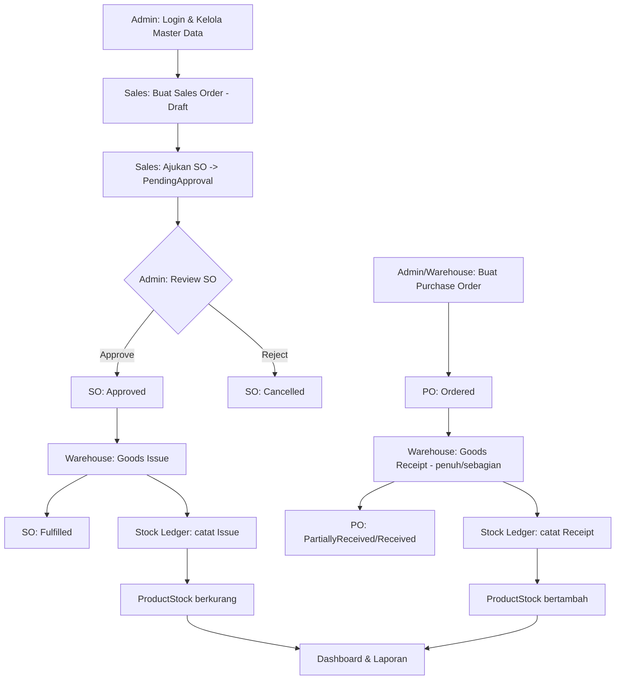

# BRD — Business Requirements Document
## Inventory & Order Management System

> Disusun berdasarkan *Final Project Brief — Intermediate Programmer* (PT Neuronworks Indonesia, Edisi 1.0, Okt 2026). Dokumen ini melengkapi [SPEC.md](SPEC.md) dengan sudut pandang bisnis — kebutuhan, aturan, dan kriteria sukses — sebagai dasar sebelum masuk ke desain teknis (`docs/planning/`). Brief PDF asli tetap sumber kebenaran resmi bila ada perbedaan.

| | |
|---|---|
| **Dokumen** | Business Requirements Document (BRD) |
| **Project** | Inventory & Order Management System |
| **Pemilik proses bisnis** | Tim Gudang & Sales (simulasi) |
| **Pelaksana** | Programmer (individual) |
| **Versi** | 1.0 |
| **Tanggal** | 2026-09-04 |
| **Status** | Draft — menunggu review trainer sebelum lanjut ke desain teknis |

---

## 1. Latar Belakang & Masalah Bisnis

Tim gudang dan sales saat ini tidak memiliki satu sistem yang mempertemukan tiga kebutuhan sekaligus: mencatat produk secara konsisten, mengelola stok di beberapa gudang, dan memproses transaksi pembelian (dari supplier) maupun penjualan (ke customer) — sambil memastikan angka stok selalu bisa dipertanggungjawabkan, termasuk ketika dua transaksi berjalan bersamaan.

Selain itu, proses bisnis saat ini rawan konflik kepentingan: tanpa pemisahan tanggung jawab yang tegas, satu orang berpotensi membuat sekaligus menyetujui transaksi yang sama, membuka celah penyalahgunaan yang lazim ditemui pada sistem inventori dan keuangan.

**Kebutuhan bisnis:** sebuah aplikasi yang menjadi satu-satunya sumber kebenaran (single source of truth) untuk data produk, stok multi-gudang, dan transaksi PO/SO — dengan kontrol akses yang menegakkan segregation of duties di level sistem, bukan sekadar konvensi kerja.

---

## 2. Tujuan Bisnis

| # | Tujuan | Indikator |
|---|---|---|
| BO-1 | Stok selalu akurat dan bisa ditelusuri | Setiap perubahan stok punya jejak di Stock Ledger; tidak ada stok negatif |
| BO-2 | Tidak ada satu peran yang bisa membuat sekaligus menyetujui transaksi yang sama | Sales tidak bisa approve order sendiri, ditegakkan di server |
| BO-3 | Keputusan restock dan penjualan didasarkan data real-time | Dashboard & laporan dihitung dari query agregasi, bukan angka statis |
| BO-4 | Operasional tetap berjalan saat volume transaksi bertambah | Pencarian, filter, sort, pagination tersedia di seluruh daftar utama |
| BO-5 | Sistem dapat dipercaya saat transaksi terjadi bersamaan | Goods issue/receipt tidak pernah menghasilkan oversell (race-condition safe) |

---

## 3. Ruang Lingkup

### 3.1 Termasuk dalam Scope
- Manajemen user 3 peran (Admin, Sales, Warehouse Staff) tanpa registrasi publik.
- Master data: produk, kategori, gudang, supplier, customer.
- Alur Purchase Order → Goods Receipt (termasuk penerimaan sebagian).
- Alur Sales Order → Approval → Goods Issue.
- Stock Ledger sebagai catatan tunggal seluruh pergerakan stok.
- Dashboard dan laporan CSV sesuai hak akses masing-masing peran.
- Minimal satu endpoint JSON API publik-internal (dengan autentikasi).
- Script terjadwal untuk deteksi produk di bawah reorder point.

### 3.2 Di Luar Scope
Microservices, message queue sungguhan, deployment cloud, CI/CD, Kubernetes, notifikasi real-time, aplikasi mobile, cron scheduler otomatis di server produksi, automated end-to-end test, dan halaman registrasi publik.

### 3.3 Batasan Model Pengerjaan
Dikerjakan individual (bukan simulasi tim lintas fungsi); satu peserta berperan sebagai analyst, developer, dan tester sekaligus. Ini memengaruhi ekspektasi dokumentasi (BRD, ADR, refactor log) yang harus tetap lengkap meski tanpa tim.

---

## 4. Stakeholder & Peran Bisnis

| Peran | Kepentingan | Wewenang Utama |
|---|---|---|
| **Admin** | Menjaga integritas master data dan approval; visibilitas penuh atas operasi | Kelola user, kelola master data, approve/reject SO, kelola PO, lihat seluruh dashboard |
| **Sales** | Memenuhi pesanan customer secara akurat dan cepat | Buat & ajukan SO milik sendiri; lihat katalog; lihat ringkasan order sendiri |
| **Warehouse Staff** | Menjaga akurasi fisik stok dan memenuhi order tepat waktu | Proses goods receipt & goods issue; usulkan PO; lihat stok & antrean fulfillment |
| **Supplier** *(eksternal, tidak login)* | Menerima PO dan mengirim barang | Direpresentasikan sebagai master data, bukan pengguna sistem |
| **Customer** *(eksternal, tidak login)* | Menerima barang sesuai pesanan | Direpresentasikan sebagai master data, bukan pengguna sistem |
| **Assessor / Trainer** | Menilai kesesuaian solusi dengan brief | Melakukan review demo, engineering evidence, dan technical defense |

---

## 5. Proses Bisnis Utama (Business Process Flow)

**Catatan bisnis penting pada alur ini:**
- Sales **tidak pernah** bisa menyetujui order miliknya sendiri — ini bukan pengaturan UI, melainkan aturan yang harus tetap berlaku meski pengguna mencoba memanggil fungsi approve secara langsung.
- Stok tidak pernah berubah tanpa melalui satu transaksi yang mencatat baris di Stock Ledger. Ini adalah kontrak bisnis: "kalau tidak ada di ledger, perubahan itu tidak sah."
- PO dan SO adalah dua alur independen yang bertemu di satu titik: ProductStock dan Stock Ledger.

---

## 6. Kebutuhan Bisnis (Business Requirements)

Setiap BR di bawah dipetakan ke kode requirement teknis pada [SPEC.md](SPEC.md) untuk traceability.

### 6.1 Akses & Akuntabilitas
| Kode | Kebutuhan Bisnis | Ref. Teknis |
|---|---|---|
| BR-01 | Setiap transaksi harus bisa ditelusuri ke satu akun pengguna yang bertanggung jawab (dibuat oleh, disetujui oleh, diproses oleh) | AUTH-01, SO-01, PO-01 |
| BR-02 | Akun hanya dibuat oleh Admin; tidak ada jalur pendaftaran mandiri | USR-01 |
| BR-03 | Akun nonaktif langsung kehilangan akses tanpa perlu menghapus riwayat data yang pernah dibuatnya | USR-01 |

### 6.2 Segregation of Duties
| Kode | Kebutuhan Bisnis | Ref. Teknis |
|---|---|---|
| BR-04 | Pembuat Sales Order tidak boleh menjadi penyetujunya, tanpa pengecualian | SO-01 |
| BR-05 | Hanya Admin yang berwenang menyetujui/menolak Sales Order | SO-01 |
| BR-06 | Sales tidak memiliki wewenang membuat Purchase Order; hanya dapat mengusulkan lewat Warehouse Staff atau Admin | PO-01 |

### 6.3 Integritas Stok
| Kode | Kebutuhan Bisnis | Ref. Teknis |
|---|---|---|
| BR-07 | Stok tidak pernah bernilai negatif dalam kondisi apapun | DB-01, ARCH-02 |
| BR-08 | Setiap penambahan/pengurangan stok wajib memiliki jejak audit (siapa, kapan, referensi transaksi apa) | DB-01 |
| BR-09 | Dua permintaan pengeluaran stok yang terjadi hampir bersamaan pada produk & gudang yang sama tidak boleh menyebabkan stok terjual melebihi yang tersedia | ARCH-02 |
| BR-10 | Penerimaan barang dari supplier boleh dilakukan bertahap (partial), dan sisa kuantitas yang belum diterima harus tetap tercatat sampai selesai atau dibatalkan | PO-01 |

### 6.4 Master Data
| Kode | Kebutuhan Bisnis | Ref. Teknis |
|---|---|---|
| BR-11 | Produk, supplier, dan customer yang sudah pernah bertransaksi tidak boleh dihapus permanen — hanya dinonaktifkan, agar riwayat transaksi lama tetap valid | PRD-01 |
| BR-12 | Setiap produk memiliki titik reorder (reorder point) sebagai sinyal kapan harus melakukan pembelian ulang | PRD-01 |
| BR-13 | Stok dikelola per gudang, bukan sebagai satu angka global, karena kebutuhan operasional berbeda di tiap lokasi | WH-01 |

### 6.5 Visibilitas & Pelaporan
| Kode | Kebutuhan Bisnis | Ref. Teknis |
|---|---|---|
| BR-14 | Setiap peran hanya melihat data yang relevan dengan tanggung jawabnya (Admin: semua; Sales: order miliknya; Warehouse: stok & antrean fulfillment) | DASH-01 |
| BR-15 | Manajemen dapat mengekspor riwayat pergerakan stok dan status order dalam rentang tanggal tertentu untuk keperluan rekonsiliasi/audit | REPORT-01 |
| BR-16 | Angka pada dashboard dan laporan harus selalu konsisten dengan data transaksi terbaru — tidak boleh berupa angka yang di-cache/statis dan menyesatkan pengambilan keputusan | DASH-01, REPORT-01 |

### 6.6 Ketersediaan & Skalabilitas Operasional
| Kode | Kebutuhan Bisnis | Ref. Teknis |
|---|---|---|
| BR-17 | Pengguna dapat menemukan produk atau order tertentu dengan cepat meski jumlah data bertambah banyak (pencarian, filter, sort, pagination) | FIND-01 |
| BR-18 | Sistem dapat diakses dari perangkat mobile maupun desktop staf gudang/sales di lapangan | UI-01 |
| BR-19 | Integrasi dengan sistem lain (mis. aplikasi pengecekan stok pihak ketiga) dimungkinkan lewat kontrak data terbuka (API) | API-01 |

---

## 7. Aturan Bisnis Kunci (Business Rules)

1. **Ledger adalah kebenaran, bukan angka stok.** ProductStock adalah hasil turunan dari akumulasi StockLedger; keduanya wajib konsisten setiap saat.
2. **Approval terpisah dari pembuatan.** Tidak ada satu akun yang dapat menyelesaikan siklus transaksi SO sendirian dari draft sampai approved.
3. **Non-destructive deactivation.** Data master yang sudah terpakai pada transaksi tidak boleh dihapus, hanya dinonaktifkan.
4. **Fail-safe di server, bukan di tampilan.** Semua aturan otorisasi dan segregation of duties berlaku terlepas dari apakah tombol/menu terkait ditampilkan di UI atau tidak.
5. **Konkurensi tidak boleh merusak kebenaran data.** Ketika dua staf gudang memproses goods issue pada waktu yang hampir sama untuk produk yang sama, hasil akhirnya harus sama seperti jika keduanya diproses satu per satu secara berurutan.

---

## 8. Kebutuhan Data (Business View)

| Entitas Bisnis | Deskripsi | Pemilik Proses |
|---|---|---|
| User | Representasi staf dengan satu dari tiga peran | Admin |
| Warehouse | Lokasi fisik penyimpanan stok | Admin |
| Category & Product | Katalog barang yang diperjualbelikan | Admin |
| ProductStock | Kuantitas produk per gudang saat ini | Sistem (turunan dari Ledger) |
| Supplier & Customer | Pihak eksternal transaksi PO/SO | Admin |
| PurchaseOrder | Komitmen pembelian ke supplier | Admin / Warehouse Staff |
| SalesOrder | Komitmen penjualan ke customer | Sales (dibuat) / Admin (disetujui) / Warehouse (dipenuhi) |
| StockLedger | Riwayat lengkap setiap pergerakan stok | Sistem (ditulis otomatis oleh service) |

Detail field dan nilai tetap ada di [SPEC.md §1.3](SPEC.md#13-entities--nilai-tetap).

---

## 9. Ekspektasi Kualitas dari Sudut Pandang Bisnis

- **Keandalan:** transaksi stok tidak boleh gagal diam-diam; kegagalan harus terlihat jelas dan tidak meninggalkan data setengah jadi.
- **Keamanan:** kredensial dan data transaksi tidak boleh bocor lewat pesan error atau celah otorisasi yang hanya mengandalkan tampilan UI.
- **Auditability:** setiap keputusan (siapa approve, siapa proses goods issue) harus dapat direkonstruksi dari data yang tersimpan.
- **Kesinambungan:** sistem harus bisa dibangun ulang dari kondisi bersih (fresh install) tanpa ketergantungan pada mesin pengembang tertentu — ini krusial karena sistem harus dapat diserahterimakan (mis. ke staf IT lain) tanpa dokumentasi tambahan di luar README.

---

## 10. Asumsi & Batasan

**Asumsi:**
- Satu produk dapat memiliki stok di lebih dari satu gudang, tetapi satu Sales Order hanya berasal dari satu gudang.
- Supplier dan Customer adalah entitas pasif (master data), tidak memiliki akun login di sistem ini.
- Harga beli dan harga jual dicatat per baris item transaksi (historical), bukan hanya merujuk ke harga master data saat ini.

**Batasan:**
- Tidak ada anggaran untuk infrastruktur produksi sungguhan — seluruh evaluasi berjalan di lingkungan Docker lokal.
- Tidak ada tim QA terpisah; pengujian menjadi tanggung jawab peserta yang sama dengan developer.
- Waktu pengerjaan terbatas pada jadwal program (checkpoint bersama trainer), sehingga prioritas mengikuti urutan vertical slice pada SPEC.md §2.

---

## 11. Kriteria Sukses & Penerimaan (Acceptance)

| Kriteria | Ukuran |
|---|---|
| Seluruh proses bisnis inti berjalan end-to-end | Login → PO/GR → SO/Approval/GI → Ledger → Dashboard dapat didemokan tanpa intervensi manual pada data |
| Tidak ada pelanggaran segregation of duties | Percobaan Sales melakukan approve pada order sendiri ditolak oleh server |
| Tidak ada inkonsistensi stok | Nilai ProductStock selalu sama dengan akumulasi StockLedger terkait |
| Tidak terjadi oversell | Skenario dua goods issue bersamaan pada stok terbatas menghasilkan satu diterima, satu ditolak/ditunda |
| Nilai project ≥ 80 dan tanpa critical failure | Sesuai kriteria penilaian pada brief §8 |

---

## 12. Risiko Bisnis & Mitigasi

| Risiko | Dampak | Mitigasi |
|---|---|---|
| Race condition pada goods issue diabaikan | Oversell, data stok tidak dapat dipercaya | Transaksi eksplisit + mekanisme locking pada level repository (lihat ARCH-02 di SPEC.md) |
| Aturan segregation of duties hanya diterapkan di UI | Pengguna dapat menyalahgunakan endpoint langsung | Validasi otorisasi wajib di server/service layer, diuji lewat integration test |
| Dokumentasi desain tidak sinkron dengan kode aktual | Tidak lulus technical defense (class diagram tidak bisa ditelusuri) | Update class diagram as-built di akhir siklus, bukan hanya di awal |
| Scope creep ke fitur bonus sebelum requirement wajib stabil | Requirement wajib tidak selesai tepat waktu | Ikuti urutan vertical slice; bonus dikerjakan terakhir (lihat SPEC.md §4.4) |

---

## 13. Glossary

| Istilah | Arti |
|---|---|
| PO | Purchase Order — pesanan pembelian ke supplier |
| SO | Sales Order — pesanan penjualan ke customer |
| Goods Receipt | Pencatatan barang masuk dari PO ke gudang |
| Goods Issue | Pencatatan barang keluar dari gudang untuk memenuhi SO |
| Stock Ledger | Buku besar pergerakan stok — catatan tunggal semua perubahan kuantitas |
| Reorder Point | Ambang batas stok yang memicu kebutuhan pembelian ulang |
| Segregation of Duties (SoD) | Prinsip pemisahan tanggung jawab agar satu pihak tidak dapat membuat dan menyetujui transaksi yang sama |
| Oversell | Kondisi stok terjual melebihi yang tersedia akibat kegagalan kontrol konkurensi |

---

## 14. Referensi

- [SPEC.md](SPEC.md) — Ringkasan teknis lengkap (requirement wajib, arsitektur, testing, submission package).
- *Final Project Brief — Intermediate Programmer*, PT Neuronworks Indonesia, Participant Guide Edisi 1.0, Oktober 2026 (dokumen sumber resmi).

---

## 15. Persetujuan

| Peran | Nama | Tanggal | Catatan |
|---|---|---|---|
| Peserta / Penyusun | | | |
| Trainer / Reviewer | | | Simpan jawaban klarifikasi requirement di `docs/planning/` sesuai FAQ #12 pada SPEC.md |

*Dokumen ini adalah pelengkap non-normatif; jika terjadi perbedaan dengan brief PDF resmi atau SPEC.md, keduanya tetap menjadi acuan yang berlaku.*
